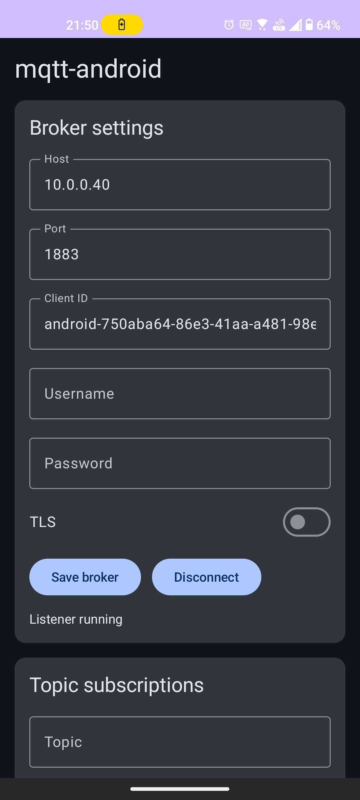
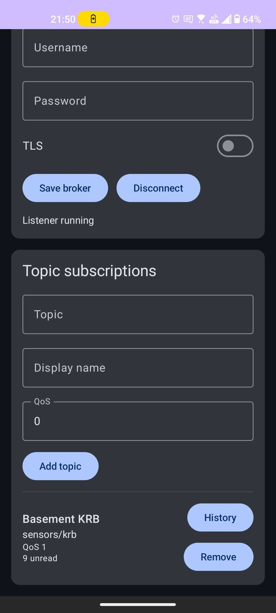

# mqtt-android

mqtt-android is a minimal yet full-featured listener for a single MQTT broker on Android. The Compose-based setup screen lets you define the broker endpoint, add multiple topic subscriptions (each with its own QoS and display name), and then start a foreground listener that keeps the device synced even when the app is in the background. Incoming messages land in a Room-backed history, fire notifications, and trigger text-to-speech announcements so you never miss a critical event.

## Highlights
- **Single broker configuration** — the broker repository (Room) stores TLS, port, credentials, clean session, keep-alive, and sync toggle data so the service always reconnects to the same endpoint.
- **Multi-topic subscriptions with QoS** — the setup UI accepts multiple topic strings, display names, and QoS values (0–2), tracks unread counts, and lets you mark topics as read or clear the stored history per topic.
- **Foreground listener, notifications, and speech** — `MqttSyncService` uses a Paho gateway to keep one MQTT connection alive and publishes status updates to the `sync_status` channel; notifications fire for each incoming message when the app has permission, and `MqttEventSpeaker` announces arrivals only when TextToSpeech reports it can speak.

## Screenshot
| Broker setup | Topic subscriptions |
| --- | --- |
|  |  |

## Quick Start
1. Launch the app, fill in Host, Port, and Client ID (the UI defaults the client ID for you), flip TLS on if needed, and provide optional credentials.
2. Add each topic you care about with a display name and QoS between 0 and 2. The list below will show unread counts and let you expand a topic to view or clear its history.
3. Tap “Connect” to save the broker config and start the foreground listener. The status card echoes the last saved or running listener state while `MqttSyncService` keeps the connection open; notifications and text-to-speech announcements follow incoming messages when the app has the required permissions and resources.

## Usage walkthrough
1. Configure the broker: fill Host, Port, and Client ID (a reasonable default is generated for you), toggle TLS if needed, and add optional credentials. Tap `Save broker` to persist the settings and then `Connect` to enable sync; the screen surface reflects the listener state and recent status messages.
2. Add topics: supply the MQTT topic string, give it a friendly display name, and choose a QoS (0–2). Each saved topic shows unread counts and lets you expand it to read the stored payloads, mark everything as read, or clear its history, which resets the unread count.
3. Start and stop the listener: `Connect` initiates `MqttSyncService`, updates the status text to `Listener running`, and switches the button to `Disconnect` so you can stop the foreground service at any time.
4. Notifications, history, and speech: while the listener runs, every incoming message is stored locally, surfaces in the expanded history view, raises a notification on the `incoming_messages` channel if permission is granted, and triggers `MqttEventSpeaker` to announce “New event on …” when TextToSpeech is available.

## Example MQTT flow
1. Save a broker config with host `test.mosquitto.org` and port `1883` (or the TLS port if you prefer).
2. Add the topics you want to follow, e.g., `sensors/frontdoor` with a friendly display name and QoS 1.
3. Tap “Connect” so the service subscribes at QoS 1; history cards will populate as messages arrive, and you can expand a topic to mark everything read or clear the queue.
4. From another terminal or device, publish a message to that same broker. Example using `mosquitto_pub` with the matching host/port:

```
mosquitto_pub -h test.mosquitto.org -p 1883 -t sensors/frontdoor -m "Front door opened" -q 1
```

The background service receives the message, stores it in the local history, raises a notification if the permission is granted, and speaks a brief announcement when TextToSpeech is available.
## Build requirements
- Java 17 (the Kotlin JVM target and compile options are set to 17 in `app/build.gradle.kts`).
- App targets Android API level 29+ (minSdk 29, compile/target 35 as configured in `app/build.gradle.kts`), and the Gradle script already pulls in Jetpack Compose, Room, Coroutines, and the Kotlin 17 toolchain via its dependencies and options.
- Jetpack Compose + Room + Coroutines (already pulled in via the dependencies defined in `app/build.gradle.kts`).

## Build/test from CLI
- `./gradlew test` — runs the JVM unit tests that cover repository and domain logic.
- `./gradlew assembleDebug` — produces `app/build/outputs/apk/debug/app-debug.apk` so you can sideload the latest build.

## Install/launch from CLI
- Install the debug APK: `adb install -r app/build/outputs/apk/debug/app-debug.apk`.
- Launch the launcher intent: `adb shell monkey -p com.example.mqttandroid -c android.intent.category.LAUNCHER 1`.
- These commands assume a connected Android device or emulator with USB debugging enabled.
- The package ID `com.example.mqttandroid` is the same as the `applicationId` and is what the service and CLI tests assume when they talk to the OS.

## Release signing notes
Drop a `keystore.properties` file next to `settings.gradle.kts` if you want to sign release builds. Populate it with the usual properties (`storeFile`, `storePassword`, `keyAlias`, `keyPassword`) and ensure the file is ignored by version control. The Gradle script reads the file, creates a `localRelease` signing config, and wires it into the `release` build type only when the file exists; otherwise the release APK remains unsigned.

## Project layout
- `app/src/main/java/com/example/mqttandroid/data` — Room DAOs, entities, and repositories for broker config, topic subscriptions, and stored messages (e.g., `BrokerRepository`, `TopicRepository`, `MessageRepository`).
- `app/src/main/java/com/example/mqttandroid/domain` — connection verification and incoming message processing logic (`MqttConnectionVerifier`, `IncomingMessageProcessor`).
- `app/src/main/java/com/example/mqttandroid/mqtt` — lightweight wrappers around Paho (`PahoMqttClientGateway`, `MqttConnectionConfig`, `MqttReconnectPolicy`, `MqttConnectionState`).
- `app/src/main/java/com/example/mqttandroid/service` — `MqttSyncService` keeps the foreground listener alive, manages connection state, and orchestrates subscriptions.
- `app/src/main/java/com/example/mqttandroid/notifications` — notification channels and factory logic that gate notifications on the stored topic preferences and Android’s permission model.
- `app/src/main/java/com/example/mqttandroid/speech` — `MqttEventSpeaker` uses `TextToSpeech` to announce incoming events when the engine is available.
- `app/src/main/java/com/example/mqttandroid/ui/setup` — Compose `SetupScreen` controls, status cards, topic history cards, and actions for marking/clearing history.
- `app/src/main/java/com/example/mqttandroid/setup` — `SetupDefaults` seeds defaults such as port `1883`.
- `app/src/main/res` — strings, themes, and notification channel names referenced by the service and UI.
- `app/schemas` — Room schema artifacts generated by KSP for `ReceivedMessage` and topic tables.
